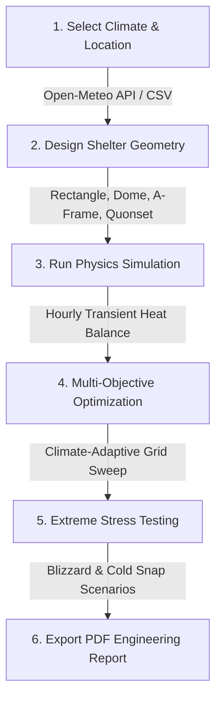

# ShelterIQ — DRDO Passive Shelter Thermal Design & Optimization Platform

> **Thermal simulation, climate-adaptive optimization, and extreme resilience stress testing for military shelters in high-altitude environments (Leh, Ladakh — 3,500m elevation).**

---

## ⚡ Engineering Workflow



### 1. **Climate & Location Selection** (`/climate`)
Pull real-time hourly meteorological data (temperature, solar radiation, wind speed) from the **Open-Meteo API** for any GPS location, or upload custom CSV weather files.

### 2. **3D Shelter Design** (`/shelter-designer` & `/new-simulation`)
Select from 4 shelter geometries (**Rectangle, Dome, A-Frame, Quonset**), configure dimensions, set wall/roof/insulation material layers, and preview live in interactive **Three.js 3D**.

### 3. **Transient Physics Engine** (`/simulation-results`)
Calculate hourly indoor temperature evolution over 24-hour cycles. Accounts for multi-layer Fourier conduction, McAdams wind convection, Swinbank sky radiation, window solar heat gain (SHGC), occupant internal gains, and 3,500m high-altitude air density adjustments.

### 4. **Climate-Adaptive Design Optimization** (`/optimization`)
Automatically optimize shelter orientation ($0^\circ - 315^\circ$), window-to-wall ratio ($10\% - 25\%$), and insulation thickness. Scores performance using a transparent **100-Point Optimization Metric**.

### 5. **Extreme Climate Resilience Testing** (`/optimization` -> Stress Test)
Freeze the optimized design and stress-test it against extreme climate perturbations (Severe Cold, Extreme Blizzard $-10^\circ\text{C}$, Heatwave). Classifies resilience into **STABLE**, **MODERATE RISK**, or **CRITICAL**.

### 6. **PDF Engineering Reports** (`/reports`)
Generate and download multi-page vector PDF engineering reports with executive summaries, thermal budget graphs, material schedules, and resilience ratings.

---

## ✨ Key Features

* 📐 **4 Passive Shelter Geometries:** Rectangle (Gable Roof), Geodesic Dome, A-Frame, and Quonset Arch.
* 🎮 **Interactive 3D Visualizer:** Powered by Three.js & React Three Fiber with cardinal orientation and material preview.
* 🌡️ **High-Altitude Physics Solver:** Altitude-corrected air density ($\rho \approx 0.80\text{ kg/m}^3$), Swinbank sky radiation, and explicit Euler transient numerical integration.
* 🎯 **Design Optimization Engine:** Multi-variable parameter grid sweeps generating a transparent 100-Point Design Optimization Score.
* 🛡️ **Climate Stress Test Module:** Evaluates structural-thermal resilience under extreme blizzard snaps and sub-zero freezing risks.
* 📊 **Executive Dashboard & 24hr Charts:** KPI overview cards, quick actions, and interactive Recharts time-series graphs.
* 📄 **Automated PDF Generator:** Server-side PDFKit report generator with inline viewing and direct download options.

---

## 🚀 Quick Start Guide

### Prerequisites
* **Node.js:** v18+ 
* **npm:** v9+
* **MongoDB**

### Step 1: Set Up Backend Environment

Create `server/.env`:
```env
PORT=5000
JWT_SECRET=drdo_passive_shelter_thermal_secret_key_2026
MONGODB_URI=mongodb://127.0.0.1:27017/drdo_shelter_thermal
CLIENT_URL=http://localhost:5173
OPENAI_API_KEY=
```

Start backend:
```bash
cd server
npm install
npm start
```

### Step 2: Start Frontend Application

In a new terminal:
```bash
cd client
npm install
npm run dev
```

Open your browser at **http://localhost:5173**.

---

## 📁 Project Structure

```
ShelterIQ/
├── client/                     ← React 18 + Vite Frontend
│   ├── src/
│   │   ├── components/         ← Reusable Layout, Navbar, Sidebar, Map Picker
│   │   ├── pages/              ← Dashboard, Wizard, Optimization, Reports, Designer
│   │   ├── services/           ← Axios REST client & Socket.IO instance
│   │   └── three/              ← Three.js / R3F 3D Shelter Renderer
│   └── package.json
│
└── server/                     ← Node.js + Express Backend
    ├── src/
    │   ├── config/             ← Database & In-Memory Store Fallback
    │   ├── models/             ← MongoDB Schemas (Shelter, Simulation, Climate)
    │   ├── physics/            ← Transient Thermal Physics & Stress Test Engines
    │   ├── optimization/       ← Design Optimization Engine & Search Sweeps
    │   ├── routes/             ← Express REST API Handlers
    │   └── services/           ← PDFKit PDF Generator & Open-Meteo Connector
    └── package.json
```

---

## 🔌 API Endpoint Summary

| Method | Endpoint | Description |
|---|---|---|
| `POST` | `/api/auth/login` | Authenticate user & issue JWT token |
| `GET` | `/api/shelters` | Fetch saved shelter designs |
| `POST` | `/api/climate/import` | Fetch Open-Meteo weather data by GPS coordinates |
| `POST` | `/api/simulation/run-auto` | Execute transient thermal simulation |
| `POST` | `/api/optimization/climate-adaptive` | Run Feature 2 Climate-Adaptive Design Optimization |
| `POST` | `/api/optimization/stress-test` | Run Feature 3 Extreme Climate Resilience Stress Test |
| `POST` | `/api/reports/generate` | Generate vector PDF engineering report |
| `GET` | `/api/reports/download/:filename` | Download or view generated PDF report |

---